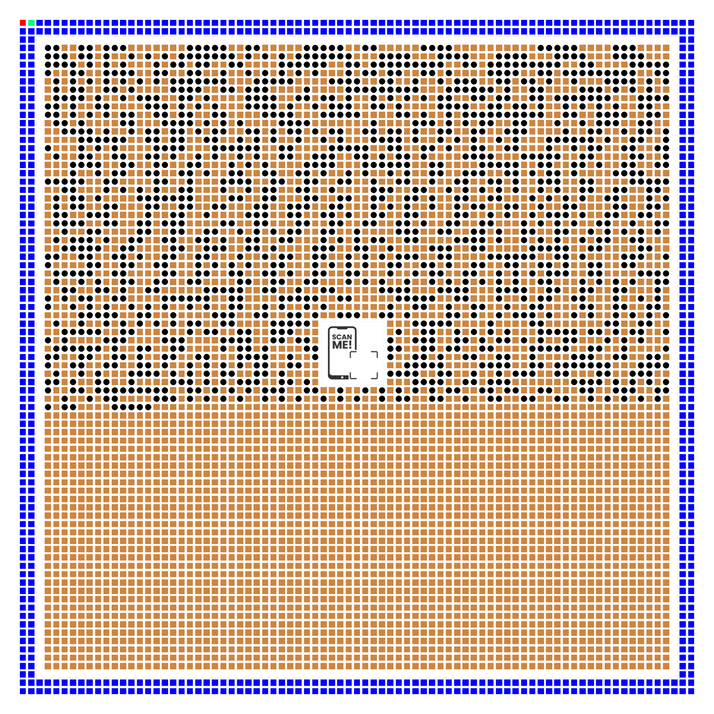

# Custom QR Code Communication Protocol with Hamming Error Correction



## 📌 Project Overview

This project implements a **communication protocol** based on **visually customized QR codes** integrated with **Hamming (7,4) error correction** to ensure robust and reliable data transmission. Unlike standard QR codes, this system uses a unique visual language combining circles and squares, alongside color markers, to encode data with built-in error resilience and automatic orientation detection.

Developed as part of academic research at Université Clermont Auvergne - ISIMA, this protocol provides:

- **Reliable communication** via error correction at the module (bit) level
- **Visually distinct modules** for better human and machine interpretability
- **Automatic orientation detection** to correctly interpret codes regardless of rotation
- **Custom image embedding** without compromising data integrity

---

## 📂 Files Organization

Make sure all the following files are located in the **same directory** before running the scripts:

- `qr_code.png` (Example QR code image)
- `scan_me.jpg` (Image used for central embedding)
- `codeur.ipynb` (Jupyter notebook for encoding)
- `décodeur.ipynb` (Jupyter notebook for decoding)
- `requirements.txt` (Python dependencies)

---

## 🛠️ Technical Implementation Details

### 1. Encoding Process

#### a. Text to Binary Conversion

- Input text is first converted from ASCII characters into their 8-bit binary representation.
- Each byte is then split into two **nibbles** (4-bit blocks), as Hamming (7,4) operates on 4-bit data units.

#### b. Hamming (7,4) Code — Error Correction Coding

Hamming (7,4) is a linear block code that maps 4 data bits to 7 bits by adding 3 parity bits for error detection and correction. This enables **single-bit error correction** and **double-bit error detection** per block.

- Data bits: d1, d2, d3, d4
- Parity bits: p1, p2, p3

The parity bits are calculated as follows:

\[
\begin{aligned}
p_1 &= d_1 \oplus d_2 \oplus d_4 \\
p_2 &= d_1 \oplus d_3 \oplus d_4 \\
p_3 &= d_2 \oplus d_3 \oplus d_4 \\
\end{aligned}
\]

Where \(\oplus\) denotes XOR.

**Encoding example (Python):**
```python
def hamming_encode(nibble):
    p1 = nibble[0] ^ nibble[1] ^ nibble[3]
    p2 = nibble[0] ^ nibble[2] ^ nibble[3]
    p3 = nibble[1] ^ nibble[2] ^ nibble[3]
    return [p1, p2, nibble[0], p3, nibble[1], nibble[2], nibble[3]]
````

Each 7-bit encoded block contains 4 data bits and 3 parity bits, enabling error correction during decoding.

#### c. Visual Module Generation

Instead of standard black/white square modules, this protocol uses:

* **Black circles (●)** to represent binary 1
* **Brown squares (■)** to represent binary 0

This choice enhances the visual distinctiveness and can improve decoding accuracy by shape recognition, especially under noise or partial occlusion.

#### d. Orientation Markers

To allow **automatic detection of QR code rotation**, the system places:

* **Red square markers** on the top-left corner
* **Green square markers** on the bottom-right corner

These unique colored markers enable the decoder to:

* Determine the code’s rotation
* Align the decoding grid properly
* Avoid misinterpretation caused by physical rotation of the code

#### e. Central Image Embedding

A custom image (e.g., a logo) can be embedded at the center without interfering with the encoded data. This is possible by reserving central modules and adjusting error correction and data layout accordingly, ensuring data integrity is maintained.

---

### 2. Decoding Process

#### a. Image Preprocessing

* The input image is converted to **HSV color space** to enhance color-based detection.
* Thresholding isolates colored markers (red and green) to detect orientation points.
* Contour detection identifies module boundaries.

#### b. Orientation Detection

Using the detected color markers:

* The system calculates the rotation angle of the QR code.
* The module grid is realigned accordingly to the canonical orientation for accurate decoding.

#### c. Symbol Recognition

Modules are recognized by shape analysis:

* **Squares** detected via polygon approximation → interpreted as 0
* **Circles** detected via contour roundness and shape metrics → interpreted as 1

**Example using OpenCV:**

```python
contours, _ = cv2.findContours(mask, cv2.RETR_TREE, cv2.CHAIN_APPROX_SIMPLE)
for cnt in contours:
    approx = cv2.approxPolyDP(cnt, 0.04*cv2.arcLength(cnt, True), True)
    if len(approx) == 4:
        # Square detected → bit = 0
    elif is_circle(cnt):
        # Circle detected → bit = 1
```

#### d. Error Correction

Each 7-bit block is checked for errors by computing the **syndrome vector**, which locates any single-bit error. If an error is detected, the bit is flipped to correct it.

* Syndrome bits $S = [s_1, s_2, s_3]$ are computed by parity checks.
* A non-zero syndrome indicates the position of the erroneous bit.
* Corrected 4-bit data is extracted.

#### e. Binary to Text Conversion

Corrected 4-bit nibbles are paired to reconstitute 8-bit ASCII characters, reconstructing the original message.

---

## 🚀 Quick Start Guide

### Install Dependencies

```bash
pip install -r requirements.txt
```

### Generate a Custom QR Code

```bash
jupyter notebook codeur.ipynb
```

### Decode a Custom QR Code

```bash
jupyter notebook décodeur.ipynb
```

---

## 📊 Performance Characteristics

| Feature                | Specification                                         |
| ---------------------- | ----------------------------------------------------- |
| Error Correction       | Single-bit correction per 7-bit block (Hamming (7,4)) |
| Maximum Message Length | Up to 400 ASCII characters                            |
| Visual Modules         | Configurable size: 21×21 to 177×177                   |
| Color Space            | HSV-based color detection                             |
| Visual Symbols         | Circles (1), Squares (0)                              |
| Orientation Markers    | Red and Green colored squares                         |

---

## 📚 Academic Context

**Author:** Houcine HAMNOUCHE
**Institution:** Université Clermont Auvergne - ISIMA
**Department:** Computer Science
**Academic Year:** 2024-2025

### Research Contributions:

* Introduction of a novel visual encoding scheme based on geometric shapes instead of traditional square pixels.
* Integration of classical Hamming error correction in a visual communication protocol.
* Robust automatic orientation detection leveraging colored markers.
* Validation through experimental tests confirming error correction efficacy and decoding reliability.
* Seamless integration of custom central images while preserving data integrity.

---

## 📄 License

This project is released under the [MIT License](LICENSE).


